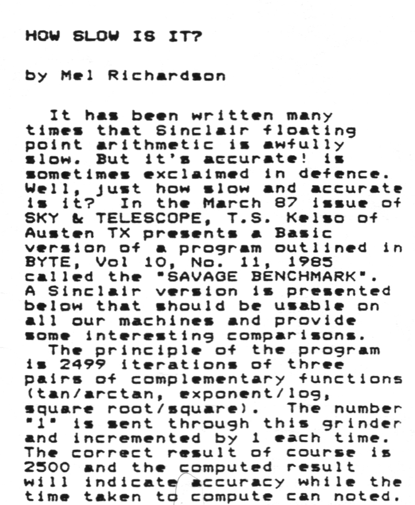
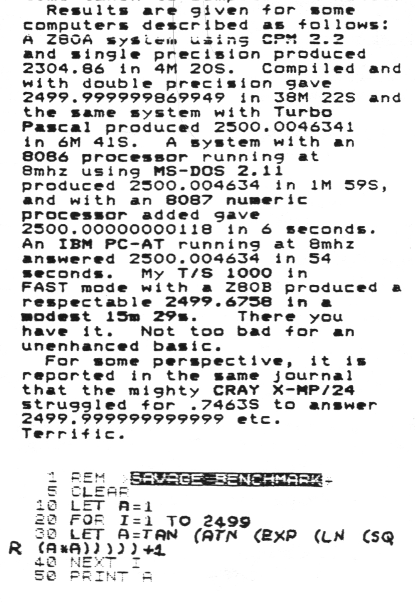

# The *Savage* benchmark

Here are various implementations of a maths-heavy benchmark which first appeared Byte magazine in 1985.
I discovered it from a ZX81 listing in the October/November 1987 issue of a newsletter called *ZX Appeal*. I was looking
for some short ZX81 programmes to type in and thought I'd give it a go.

The version presented in the newsletter ran in 15.5 minutes. Running at 28MHz on a Spectrum Next in ZX81 mode, it took 2m 5s.
In Spectrum Next mode, it was only slightly faster at 2m 2s.

## Benchmarks

I converted the benchmark to different languages and ran it on 3 different machines:
- Raspberry Pi 4
- An Intel Macbook pro.
- A Macbook Neo.

Originally I used 3 different languages (Python, Java and Julia) with native floating handling. I then tried high precision
maths libraries:
- mpmath for Python
- BigDecimal for Java
- Apfloat for Java (but only on the macbooks because it was much slower)

Unsurprisingly the Pi4 was the slowest.

| Machine   | Python |  Java |  mpmath | BigDecimal | Apfloat |
|-----------|-------:|------:|--------:|-----------:|--------:|
| Pi 4      |  2.3   |   478 |   0.795 |       9600 |         |
| Intel Mac |   0.69 | 176   | 0.215   |       1170 |   22580 |
| Mac Neo   |   0.27 | 64.1  | 0.233   |      662   |  8930   |

All times are in milliseconds.

## Background Information

  
 

