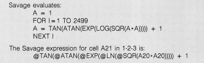
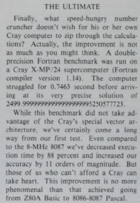

# The *Savage* benchmark

Here are various implementations of a maths-heavy benchmark which first appeared Byte magazine in 1985.
I discovered it from a ZX81 listing in the October/November 1987 issue of a newsletter called *ZX Appeal*. I was looking
for some short ZX81 programmes to type in and thought I'd give it a go.

The version presented in the newsletter ran in 15.5 minutes. Running at 28MHz on a Spectrum Next in ZX81 mode, it took 2m 5s.
In Spectrum Next mode, it was only slightly faster at 2m 2s.

## Benchmarks

I converted the benchmark to different languages and ran it on 3 different machines:
- Raspberry Pi 4
- An Intel Macbook pro.
- A Macbook Neo.

Originally I used 3 different languages (Python, Java and Julia) with native floating handling. I then tried high precision
maths libraries:
- mpmath for Python
- BigDecimal for Java
- Apfloat for Java (but only on the macbooks because it was much slower and I didn't have enough
patience to run it on the Pi)

Unsurprisingly the Pi4 was the slowest.

### Results ('modern' machines)

| Machine   | Python | mpmath | Java  | BigDecimal | Apfloat | Julia |
|-----------|-------:|-------:|------:|-----------:|--------:|------:|
| Pi 4      |    2.3 |    478 | 0.795 |       9600 |         | 0.709 |
| Intel Mac |   0.69 |    176 | 0.215 |       1170 |   22580 |       |
| Mac Neo   |   0.27 |   64.1 | 0.233 |        662 |    8930 | 0.171 |

All times are in milliseconds.

### Results (vintage computers)

These all use software floating point since back then machines with hardware floats were expensive and/or rare.

| Machine        | MHz | Language                | Time           | Result     |
|----------------|-----|-------------------------|----------------|------------|
| Spectrum Next  | 28  | Basic                   | 2m23           | 2500.6763  |
| Atari ST       | 8   | HiSoft Basic (Compiled) | 7s (single)    | 2726.9     |
| Atari ST       | 8   | HiSoft Basic (Compiled) | 3m46s (double) | 2500.00000 |
| RC2014         | 7.3 | Z80 Microsoft Basic     | 1m58s          | 2631.72    |
| Commodore 64   | 1   | Microsoft/CBM Basic     | 7m46s          | 2500.00009 |
| BBC Micro      | 2   | BBC Basic               | 5m12           | 2599.68602 |
| Sinclair QL    | 7.5 | SuperBasic              | 10.3s          | 2499.712   |

- On the Atari ST, the Single precision maths was fast but inaccurate, but the double precision was
much slower more accurate, giving `2500.000000008`.
- The RC2014 uses single precision but is more accurate than the Atari ST, giving `2631.72`.
- The BBC Basic and Sinclair QL versions were run using the appropriate cores on the Spectrum Next.
- The Sinclair machines all gave `2500±1`. The 8-bit machines use a 5 byte FP format unlike
  the more common 4 byte used in most other machines.

## Background Information

The original article in Byte magazine was comparing the speeds of the 8087 and 80287 maths co-processors
and had several different benchmarks in different languages (including Pascal, Fortran and even Lotus 1-2-3).

  

The Sky & Telescope article was evaluating the speed and accuracy of different computers and languages for
astronomical calculations.

  

### The ZX 81 version

  
 

